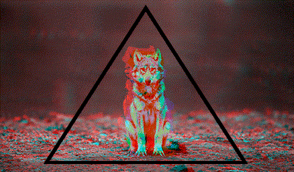

<div align="center">
  
  
  <div>
     &#8287;&#8287;&#8287;&#8287;
     &#8287;&#8287;&#8287;&#8287;
     &#8287;&#8287;&#8287;&#8287;
    
  </div>
</div> &#8287;
<div align="center">
  <a href="https://dimentique.tumblr.com/post/67903777806/source"></a>
</div>  &#8287;
<div align="center">
  <a href="https://en.wikipedia.org/wiki/C_(programming_language)"></a> &#8287;
  <a href="https://en.wikipedia.org/wiki/C%2B%2B"></a> &#8287;
  <a href="https://en.wikipedia.org/wiki/C_Sharp_(programming_language)"></a> &#8287;
  <a href="https://www.rust-lang.org/"></a> &#8287;
  <a href="https://www.lua.org/about.html"></a> &#8287;
  <a href="https://www.python.org/"></a> &#8287;
  <a href="https://en.wikipedia.org/wiki/HTML5"></a> &#8287;
  <a href="https://en.wikipedia.org/wiki/CSS"></a> &#8287;
  <a href="https://en.wikipedia.org/wiki/JavaScript"></a> &#8287;
  <a href="https://www.typescriptlang.org/"></a>
  <a href="https://go.dev/"></a> &#8287;
  <a href="https://en.wikipedia.org/wiki/Bash_(Unix_shell)"></a> &#8287;
  
</div> &#8287;
<div align="center">
  
</div>

___

### *Not a Cat ™*

Hi Internet, I'm an independent researcher, programmer since I was 10, *hacker*, and *to-be* artist with interests and knowledge ranging from biology, chemistry and engineering to psychology, neurology and medicine.

I am an Internet privacy and FLOSS (free/*libre* open-source software) <sup>a</sup> advocate and enthusiast.

*I develop games, websites, and much more!*

<sup>(a) "*Libre* software respects users' freedom, borrowing the Spanish word for *free* as in freedom" <sup>[(GNU)][GNU]</sup></sup>

[GNU]: https://www.gnu.org/philosophy/free-sw.en.html

## *Researcher?*

Indeed, over more than 4 years, I have researched a myriad of complex topics and fields, from AIs/ML, biochemistry and psychology through quantum mechanics, cosmology and their mathematics, through academic articles, books, and other authoritative sources.

Actually, I've been working on multiple scientific papers, such as on important, overlooked topics (e.g. bloat/software complexity) with a CS researcher; <sup>[a](https://github.com/adisa22)</sup> several others with an independent researcher, good friend of mine, on groundbreaking research, such as a theory of the universe and simulations; <sup>[b](https://github.com/Fultonium-Entertainment)</sup> and some personally on speech synthesis and AI; in fact, I look forward towards similarly challenging projects.

## *Hacker?*

<sup>Before you call FBI on me</sup>

[![oh-indeed][GIF]][Tenor]

[GIF]: https://media1.tenor.com/m/J--FtRHGiz0AAAAC/indeed-omar.gif
[Tenor]: https://tenor.com/view/well-yes-but-actually-no-well-yes-no-yes-yes-no-gif-13736934

a *hacker* is defined as someone "who delights over an intimate understanding of the internal workings of systems, computers and networks". <sup>[1][RFC1983]</sup>

Certainly, I do enjoy to toy around with a system or program to understand how it works and get something out of it, even after all the pain; as Wikipedia puts, "the challenge of creatively overcoming the limitations of [systems] [...] to achieve clever outcomes". <sup>[2][Wikipedia]</sup>

[RFC1983]: https://www.rfc-editor.org/rfc/rfc1983.txt
[Wikipedia]: https://en.wikipedia.org/wiki/Hacker

> In fact, I'm well-knowledgeable on cybersecurity (or if you will, *hacking*) and privacy over the Internet.

> In practice, I have reverse engineered complex software, websites and their APIs, such as the Windows UEFI bootloader [(`win11-uefi`)](https://github.com/LeCodingWolfie/win11-uefi), Widevine DRM (through Electron/Chromium), Twitter and Twitch's APIs, with programs like Ghidra, IDA, Radare2 and x64dbg as well as some programming, with good amount of knowledge on assembly code, C and other languages.

> I have been able to, both, dynamically and statically analyze software to understand their code flow. I've reconstructed solid, functional code out of disassembly and its decompilation, and even write tools to do the job.

# Acknowledgments

* [Wyatt Walsh README](https://github.com/wyattowalsh/wyattowalsh)
* [Jonah Lawrence README](https://github.com/DenverCoder1/DenverCoder1)
* [README Typing SVG](https://github.com/denvercoder1/readme-typing-svg)
* [For The Badge](https://github.com/BraveUX/for-the-badge/)
* [Simple Icons](https://github.com/simple-icons/simple-icons)
* [Devicon](https://github.com/devicons/devicon/)

___

<div align="center">
  <sup>Banner video
    <a href="https://www.pexels.com/video/close-up-view-of-colors-mixing-5612424/"><sup>a</sup></a>
    by Jorge Urosa,
    <a href="https://www.pexels.com/@jorgeural/"><sup>b</sup></a>
    licensed under the Pexels license
    <a href="https://www.pexels.com/license/"><sup>c</sup></a>
  </sup>
  <div>
    <sup>
      LaTeX logo taken from Simple Icons
      <a href="https://raw.githubusercontent.com/simple-icons/simple-icons/develop/icons/latex.svg"><sup>a</sup></a>
    </sup>
  </div>
  <details>
  <summary>FFmpeg</summary>

  ```
  ffmpeg -v warning -i loop.mp4 -vf "crop=960:288:0:118" loop-cut.mp4
  ffmpeg -v warning -i loop-cut.mp4 -vcodec libx265 -crf 28 output.mp4
  ffmpeg -v warning -i output.mp4 -vf "fps=21,scale=320:-1:flags=lanczos" output.gif
  ```

  ```
  ffmpeg -i cat-original.gif -vf "crop=160:150:100:60" cat.gif
  ```

  [^1]
  </details>
  <a href="https://www.reddit.com/r/shitposting/comments/q8uwwu/d/"></a>
</div> &#8287;

[^1]: <sup>[1][1], [2][2], [3][3]</sup> / [(a)][a] &#8287;Many people pointed out this cat is not happy, "either as a result of overheating [or] anxiety". Poor cat :(

[1]: https://reddit.com/r/shitposting/comments/q8uwwu/d/
[2]: https://www.reddit.com/r/gifs/comments/qqj7lh/d/
[3]: https://tenor.com/view/cat-gif-25013028

[a]: https://www.reddit.com/r/gifs/comments/qqj7lh/comment/hk0l3fy/?context=3

[readme-typing-svg]: https://readme-typing-svg.demolab.com?font=Fira+Code&duration=3000&pause=1000&color=F72787&center=true&vCenter=true&width=960&lines=Hi%2C+I'm+LeWolfie+a%2Fk%2Fa+Average+Toastie;I+am+a+scientist%2C+programmer+and+hacker;with+a+love+for+libre+software!
