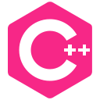

<div align="center">
  
  
  <div>
     &#8287;&#8287;&#8287;&#8287;
     &#8287;&#8287;&#8287;&#8287;
     &#8287;&#8287;&#8287;&#8287;
    
  </div>
</div> &#8287;
<div align="center">
  
</div> &#8287;
<div align="center">
  <a href="https://dimentique.tumblr.com/post/67903777806/source"><sup>(source)</sup></a>
</div> &#8287;
<div align="center">
   &#8287;
   &#8287;
   &#8287;
   &#8287;
   &#8287;
   &#8287;
   &#8287;
   &#8287;
   &#8287;
  
</div>

___

### *Not a Furry ™*

Hi Internet, as of 15, I'm a researcher with interests and knowledge ranging from biology, chemistry and engineering to psychology, neurology and medicine; also a programmer, *hacker*, and *to-be* artist.

I am an Internet privacy and FLOSS (free/*libre* <sup>a</sup> open-source software) advocate and enthusiast.

*I develop games, websites, and much more!*


<sup>(a) '"[Libre] software” means software that respects users' freedom [...] borrowing the Spanish word for "free" as in freedom' <sup>[(GNU)][GNU]</sup></sup>

[GNU]: https://www.gnu.org/philosophy/free-sw.en.html

# FAQ

## *Scientist?*


Yes, *sort of*.

> I usually read academic articles and books when I research a topic in particular, and have been reading them for over 3 years ago.

> In fact, I've recently started writing two scientific articles, one with a fellow researcher about an overlooked topic that we consider important, and I look forward to write even more on complex projects and topics.

## *Hacker?*

<sup>~Before you call the FBI on me~</sup>

a *hacker* has been defined as "[someone] who delights [over] an intimate understanding of the internal workings of a system, computers and networks" <sup>[1][RFC1983]</sup>, which I completely identify with.

I do enjoy a lot to toy around with a system or program to understand how it works and get someting out of it; as Wikipedia puts, "the challenge of creatively overcoming the limitations of [systems] [...] to achieve clever outcomes" <sup>[2][Wikipedia]</sup>.

[RFC1983]: https://www.rfc-editor.org/rfc/rfc1983.txt
[Wikipedia]: https://en.wikipedia.org/wiki/Hacker

> In fact, I'm knowledgeable about many topics that are related with cybersecurity and privacy over the Internet, or if you will, *hacking*.

> In practice, I have reverse engineered complex software, such as Windows (11) UEFI bootloader, Widevine DRM (through Electron/Chromium) and others, before with programs like Ghidra, IDA, Radare2 and x64dbg, and with good amount of knowledge on assembly code and C.

> I have been both able to dynamically and statically analyze software to understand their code flow; I've also reconstructed solid, functional code out of disassembly and its decompilation; and even write tools to do the job.

# Acknowledgments

* [Wyatt Walsh README](https://github.com/wyattowalsh/wyattowalsh)
* [Jonah Lawrence README](https://github.com/DenverCoder1/DenverCoder1)
* [README Typing SVG](https://github.com/denvercoder1/readme-typing-svg)
* [For The Badge](https://github.com/BraveUX/for-the-badge/)
* [Simple Icons](https://github.com/simple-icons/simple-icons)
* [Devicon](https://github.com/devicons/devicon/)

___

<div align="center">
  <details>
  <summary>FFmpeg</summary>

  ```
  ffmpeg -v warning -i loop.mp4 -vf "crop=960:288:0:118" loop-cut.mp4
  ffmpeg -v warning -i loop-cut.mp4 -vcodec libx265 -crf 28 output.mp4
  ffmpeg -v warning -i output.mp4 -vf "fps=21,scale=320:-1:flags=lanczos" output.gif
  ```

  ```
  ffmpeg -i cat-original.gif -vf "crop=160:150:100:60" cat.gif
  ```

  [^1]
  </details>
  
</div> &#8287;

[^1]: <sup>[1][1], [2][2], [3][3]</sup> / [(a)][a] &#8287;Many people pointed out this cat is not happy, "either as a result of overheating [or] anxiety". Poor cat :(

[1]: https://reddit.com/r/shitposting/comments/q8uwwu/d/
[2]: https://www.reddit.com/r/gifs/comments/qqj7lh/d/
[3]: https://tenor.com/view/cat-gif-25013028

[a]: https://www.reddit.com/r/gifs/comments/qqj7lh/comment/hk0l3fy/?context=3

[readme-typing-svg]: https://readme-typing-svg.demolab.com?font=Fira+Code&duration=3000&pause=1000&color=F72787&center=true&vCenter=true&width=960&lines=Hi%2C+I'm+LeWolfie+a%2Fk%2Fa+Average+Toastie;I+am+a+scientist%2C+programmer+and+hacker;with+a+love+for+libre+software!
